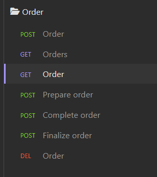

# EatEasy - Gestão de pedidos

API construída como parte do requisito de avaliação do primeiro módulo da pós tech FIAP.

A API contempla os seguintes requisitos:
- Cadastro de usuários com perfil (Admin, Cliente ou vendedor);
- Login de usuário por CPF e senha;
- Listagem de perfis;
- Cadastro, Alteração, Listagem e Edição de categorias de produtos;
- Cadastro, alteração, exclusão e listagem de produtos;
- Listagem de produtos por categoria;
- Criação e listagem de pedidos;
- Listagem de pedidos por usuário;
- Atualização de status dos pedidos para: preparando, completo e finalizado.

## Arquitetura da API


## Linguagem ubíqua


## Fluxo de compra e checkout


## Como rodar a aplicação?

*Pré requistos:*
- Ter o docker instalado na máquina;
- [Insomnia](https://insomnia.rest/download) para realizar testes nos endpoints.
*Inicializando*
Ir na pasta do projeto, abrir um prompt de comando e digitar: 
```docker-compose up -d```

O comando acima irá subir o postgres e também o processo da API. Caso prefira usar um servidor do postgres em algum outro servidor, basta ajustar os parâmetros do arquivo ```.env``` que se encontra na raiz do projeto.

Para verificar se está rodando corretamente, abra o browser e vá no endereço: [http://localhost:8000/swagger/index.html](https://localhost:8000/swagger/index.html).

## Testando

Para facilitar os testes, estou disponibilizando a collection a ser importada no insomnia. Faça o download da collection clicando [aqui](assets/Insomnia_2023-07-05.yaml). Oura opção é clicar diretamente neste botão: 
[](https://insomnia.rest/run/?label=EatEasy&uri=https%3A%2F%2Fgithub.com%2Fdigounet%2FEatEasy%2Fblob%2Fmaster%2Fassets%2FInsomnia_2023-07-05.yaml)

Para importar a collection, abra o insomnia e clique na opção import conforme imagem abaixo.


### Rotas de Usuários

Para realizar o login inicial, utilize o usuário pré-cadastrado conforme a imagem abaixo.
- CPF: 11111111111
- Senha: admin123


Para realizar cadastro de usuários não é necessário estar logado na aplicação, porém é preciso passar um perfil válido que pode ser consultado na rota de perfis.


### Rotas de categorias

Temos um CRUD (Create, Read, Update, Delete) de categorias conforme imagem abaixo.


### Rotas de produtos

Nas rotas de produtos temos os métodos para listagem, cadastro, exclusão e atualização. Dentre eles, apenas o método de listagem não obriga que o usuário esteja autenticado, para todos os outros, o usuário precisa estar autenticado com perfil de admin.

Na rota de produtos também é possível buscar produtos por categoria. Para isso, é preciso passar como parâmetro o ID da categoria (que pode ser consultado na rota de listagem de categorias).


### Rotas de pedidos

Para todas as rotas de pedidos, o usuário precisa estar autenticado. A rota de listagem de pedidos permite listar todos os pedidos (apenas para Admin e Vendedor), ou listar apenas pedidos epecíficos por usuário. Caso o usuário logado seja um Cliente, ao realizar a chamada para esta rota, serão listados apenas seus próprios pedidos.

Também temos as rotas que alteram o status do pedido para: Preparando, Completo e finalizado.


